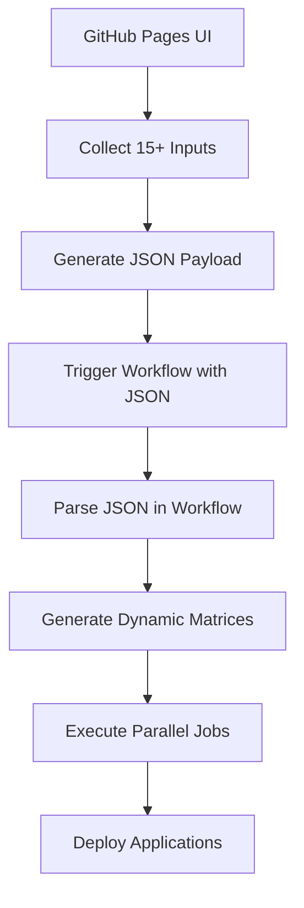

# Advanced GitHub Pages + Workflow Integration

This demonstrates how to overcome GitHub Actions' 10-input limitation using JSON payloads and GitHub Pages.

## 🎯 Problem Solved

**GitHub Actions Limitation**: Workflows can only accept 10 inputs maximum.

**Our Solution**:

- Use GitHub Pages to collect unlimited inputs
- Generate JSON payload with all configuration
- Pass JSON to reusable workflow
- Parse JSON to create dynamic matrices and variables

## 🚀 Implementation Architecture



## ✅ Benefits Demonstrated

1. **Overcome Input Limits**: 15+ inputs vs GitHub's 10 limit
2. **Dynamic Configuration**: JSON-based workflow configuration
3. **Matrix Generation**: Create dynamic job matrices from JSON
4. **User-Friendly UI**: Better than command-line or YAML editing
5. **Company Branding**: Customizable interface matching company guidelines
6. **API Integration**: Can fetch data from external APIs (Nexus, Docker registries, etc.)

## 📋 Current Implementation

### Form Inputs (15 total):

1. **Environment** (development/staging/production/qa/integration)
2. **Region** (us-east-1, us-west-2, eu-west-1, ap-southeast-1)
3. **Version** (application version)
4. **Replica Count** (1-10)
5. **Application Name**
6. **Kubernetes Namespace**
7. **Docker Image**
8. **Resource Profile** (small/medium/large/xlarge)
9. **Database Type** (postgresql/mysql/mongodb/redis)
10. **Database Version**
11. **Database Size** (10Gi/50Gi/100Gi/500Gi)
12. **Enable Logging** (checkbox)
13. **Enable Monitoring** (checkbox)
14. **Custom Environment Variables** (JSON object)
15. **Deployment Notes** (text area)

### Advanced Features:

- **Real-time JSON Preview**: See configuration as you type
- **Form Validation**: Ensure required fields are filled
- **JSON Parsing**: Safe parsing with error handling
- **Clipboard Copy**: Automatic JSON copying for easy pasting
- **Matrix Generation**: Dynamic job matrices from configuration

## 🔧 Extending for Real-World Use Cases

### API Integration Examples:

```javascript
// Fetch latest artifacts from Nexus
async function fetchNexusArtifacts() {
  const response = await fetch("/api/nexus/artifacts");
  const artifacts = await response.json();
  populateVersionDropdown(artifacts);
}

// Get latest Docker tags from registry
async function fetchDockerTags(image) {
  const response = await fetch(`/api/docker/tags/${image}`);
  const tags = await response.json();
  return tags.slice(0, 10); // Latest 10 tags
}

// Fetch available environments from infrastructure API
async function fetchEnvironments() {
  const response = await fetch("/api/environments");
  const environments = await response.json();
  return environments.filter((env) => env.status === "active");
}
```

### Advanced Workflow Patterns:

```yaml
# Multi-environment deployment matrix
strategy:
  matrix:
    include: ${{ fromJson(needs.parse-config.outputs.environment_matrix) }}
# Generated from: {"include": [{"env": "dev", "region": "us-east-1"}, {"env": "prod", "region": "eu-west-1"}]}

# Conditional job execution based on JSON flags
if: ${{ fromJson(inputs.config_json).features.enable_monitoring == true }}

# Dynamic secret names from configuration
env:
  DB_PASSWORD: ${{ secrets[format('DB_PASSWORD_{0}', fromJson(inputs.config_json).database.type)] }}
```

## 🎨 UI Customization Examples

### Company Branding:

- Custom CSS with company colors and fonts
- Logo integration
- Custom form layouts matching internal tools
- Integration with corporate identity providers

### Advanced Form Features:

- **Conditional Fields**: Show/hide fields based on selections
- **Field Dependencies**: Auto-populate related fields
- **Validation Rules**: Custom validation beyond basic required fields
- **Multi-step Forms**: Wizard-style configuration
- **Save/Load Configurations**: Store common configurations locally

## 🔄 Reusable Workflow Patterns

This approach enables several powerful patterns:

1. **Template Workflows**: Create templates that can be customized via JSON
2. **Multi-Cloud Deployments**: Configure different cloud providers dynamically
3. **Feature Toggles**: Enable/disable features via configuration
4. **Environment Promotion**: Copy configurations between environments
5. **Batch Operations**: Process multiple configurations in parallel

## 📊 Comparison

| Approach                | Max Inputs    | User Experience        | Flexibility | Maintenance |
| ----------------------- | ------------- | ---------------------- | ----------- | ----------- |
| Native GitHub Actions   | 10            | Poor (YAML editing)    | Limited     | Easy        |
| **GitHub Pages + JSON** | **Unlimited** | **Excellent (Web UI)** | **High**    | **Medium**  |
| External Tools          | Unlimited     | Varies                 | High        | Complex     |

## 🚀 Next Steps for Production

1. **Authentication**: Add proper user authentication
2. **Validation**: Server-side validation of JSON payloads
3. **Templates**: Pre-defined configuration templates
4. **History**: Configuration history and rollback
5. **Approval Workflows**: Multi-stage approval processes
6. **Integration**: Connect with monitoring and logging systems

This pattern transforms GitHub Actions from a limited workflow system into a powerful, user-friendly deployment platform! 🎉
